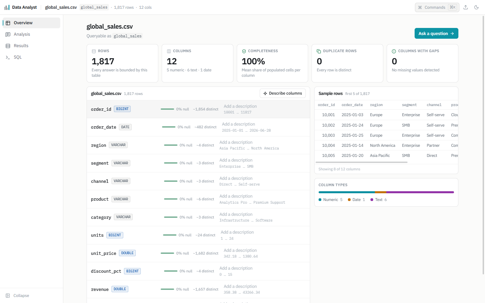
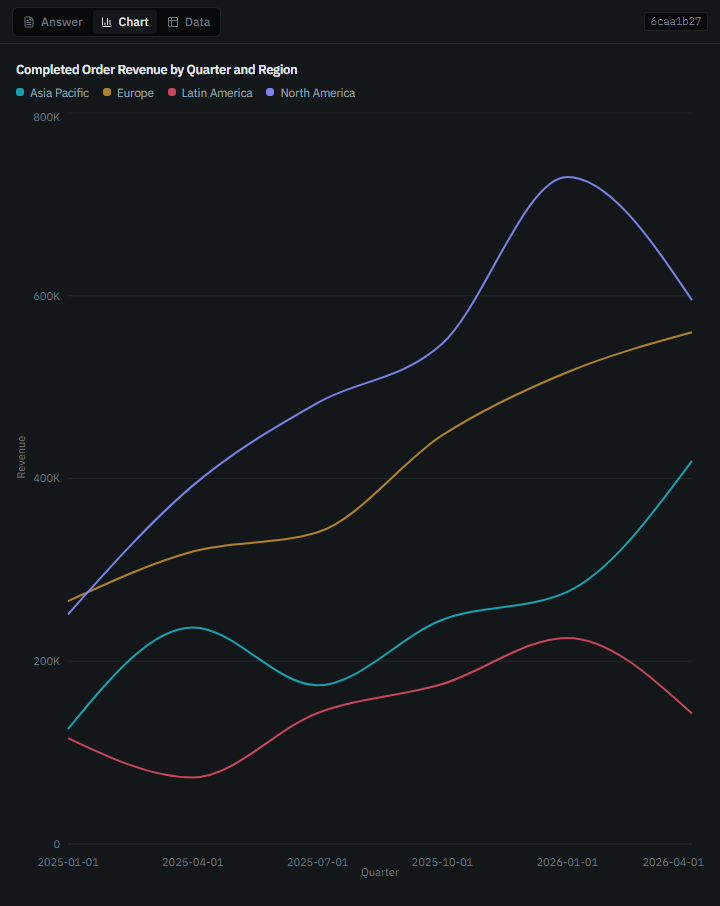
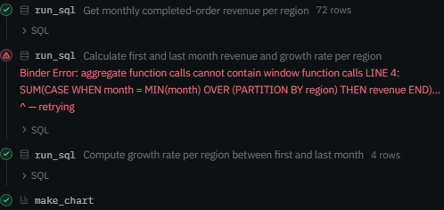
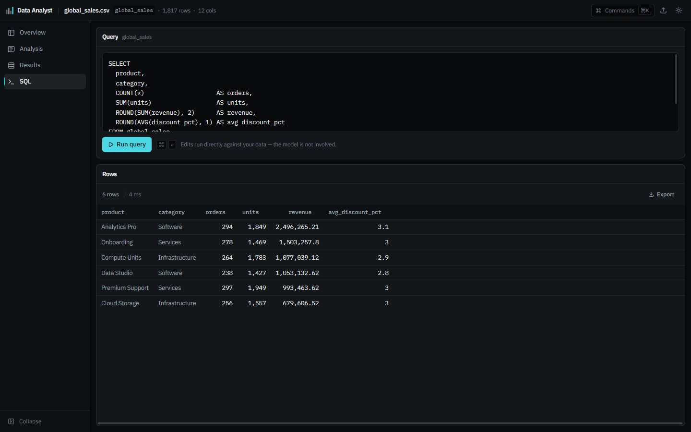
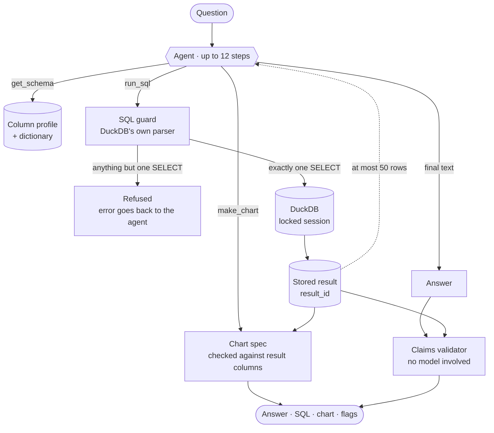

<picture>
  <source media="(prefers-color-scheme: dark)" srcset="docs/assets/banner-dark.svg">
  
</picture>

<p align="center">
  
  
  
  
  
  
  
</p>

<p align="center">
  <a href="#-see-it-work">See it work</a> ·
  <a href="#-six-guarantees">Guarantees</a> ·
  <a href="#-how-a-question-becomes-an-answer">Architecture</a> ·
  <a href="#-measured-not-assumed">Evaluation</a> ·
  <a href="#-quick-start">Quick start</a> ·
  <a href="#-roadmap">Roadmap</a>
</p>

<br>

Drop in a CSV and ask it questions in plain English. An agent writes DuckDB SQL, runs it, charts the result and explains what it found — and then **a deterministic validator reads the answer back and checks every number in it against the rows the queries actually returned.** Nothing the model says is taken on trust.

<picture>
  <source media="(prefers-color-scheme: dark)" srcset="docs/assets/overview-dark.png">
  
</picture>

## ◆ Why this exists

Chatting with a spreadsheet is easy to demo and hard to trust. A language model will happily write *"revenue grew 34%"* when no query ever computed 34% — and a plausible wrong number is worse than no number at all.

This project treats that as a defect to be caught, not a risk to be disclaimed. The model is allowed to **ask** the data; it is never allowed to be the **source** of a figure.

## ◆ See it work

<table>
  <tr>
    <td width="50%" valign="top">
      
      <p><b>Charts can't invent data.</b> The model only names columns. Rows are loaded from the stored result set, and the spec is rejected if it references a column that result doesn't have.</p>
    </td>
    <td width="50%" valign="top">
      
      <p><b>It corrects itself in the open.</b> SQL errors come back to the agent as tool results, not crashes. Every step, its SQL and its row count stay visible in the timeline.</p>
    </td>
  </tr>
</table>



<p align="center"><sub><b>Verify it by hand.</b> Every answer's SQL is editable and re-runnable — and edited queries go straight to DuckDB. The model is not involved.</sub></p>

## ◆ Six guarantees

| | Guarantee | How it's enforced |
|:-:|---|---|
| 🔒 | **Read-only by construction** | Every statement goes through DuckDB's own parser (`json_serialize_sql`) and is refused unless it is exactly one `SELECT`. No regex — comment tricks and stacked statements fool string matching, not the parser. The session is then locked: external access off, configuration frozen. → [`lib/sql/guard.ts`](lib/sql/guard.ts) · [`lib/duckdb/session.ts`](lib/duckdb/session.ts) |
| 🧾 | **No number without a source** | Each query is stored with its exact SQL and gets a `result_id`. Answers cite those ids, and the table, chart and validator all read the stored rows — never what the model repeated. → [`lib/agent/tools.ts`](lib/agent/tools.ts) |
| 🔎 | **Every figure is checked** | After the answer streams, a validator with no model in the loop extracts every number and matches it to a cited result, its row count, or a literal in its SQL. It also flags comparisons measured by something no query returned. → [`lib/validate/claims.ts`](lib/validate/claims.ts) |
| 📊 | **Charts are bound to results** | Chart specs are Zod-validated, and every referenced column is checked against the real result schema before the chart reaches the browser. → [`lib/charts/spec.ts`](lib/charts/spec.ts) |
| ✂️ | **Truncation is never silent** | Results report `row_count`, `rows_shown` and `truncated`. The model sees at most 50 rows and is told to aggregate in SQL rather than count what it was shown. |
| 🛡️ | **The file is untrusted input** | Column names, cell values and descriptions reach the prompt flattened to one line, with control and bidi characters stripped — so a cell that reads *"Ignore every earlier rule"* stays a cell. → [`lib/agent/prompt.ts`](lib/agent/prompt.ts) |

## ◆ Every figure gets checked

Here is an answer about the product revenue shown above, run through the real validator:

```diff
  Analytics Pro leads the 6 products with $2,496,265.21 in completed revenue,
- about 32% of the total.
  Onboarding follows at $1,503,257.80.
- Cloud Storage is the smallest product by order count.
```

| Claim | Verdict | Reason (verbatim from `validateClaims`) |
|---|---|---|
| `6` | ✅ supported | Row count of the cited result |
| `$2,496,265.21` | ✅ supported | A value in the cited result |
| `32%` | ⚠️ `unsupported_number` | *This figure is in none of the cited result sets. It was not produced by a query.* |
| `$1,503,257.80` | ✅ supported | A value in the cited result |
| `smallest … order count` | ⚠️ `unverified_comparison` | *This compares by "order count", which is not a column in any cited result set. That measure was never queried.* |

The share and the order-count ranking may even be right — but no query produced them, so they're flagged. Flags annotate the answer; they never hide it.

> [!NOTE]
> The comparison detector is intentionally conservative. It reads `<comparative> … by <measure>` and `<comparative> <measure>`, and will miss a comparison phrased with no explicit measure. The numeric detector is the guarantee; the comparison detector is a smoke alarm.

## ◆ How a question becomes an answer



1. **Upload.** The CSV is read by DuckDB with a full-file type scan, written to Parquet, stored privately in Vercel Blob, and profiled with `SUMMARIZE`: types, null rates, distinct counts, ranges, exact duplicate rows, and text columns that only *look* like dates.
2. **Describe (optional).** One click drafts a plain-English description for every column. You can edit any of them, and your edits are what the agent reads.
3. **Ask.** Each request opens a fresh in-memory DuckDB, loads the Parquet, locks the session, then lets the agent run `get_schema`, `run_sql`, `make_chart` and `ask_clarification`.
4. **Check.** The finished answer goes to `POST /api/validate`, which loads the cited rows server-side by `result_id`. Rows supplied in the request body are ignored, and a result from a different dataset can't lend support.

## ◆ Measured, not assumed

`pnpm eval` runs a question set against a live instance over HTTP. The fixture is a 16-row orders table built so that the obvious answers diverge: the customer with the most revenue is not the one with the most orders, and counting only paid orders changes the revenue leader. An agent that conflates those measures, or reads sample rows instead of querying, gets those questions wrong.

| Layer | What it measures | Result |
|---|---|---|
| **engine** | 20 reference queries through `POST /api/query`, compared to hand-computed rows | **20 / 20** |
| **claims** | 6 answers through `POST /api/validate`, compared to the flags each one requires | **6 / 6** |
| **agent** | Each question through `POST /api/chat`, then through the validator | opt-in — `pnpm eval --agent` |

Every expected value is written as a literal, and [`expectations.test.ts`](lib/eval/expectations.test.ts) recomputes all of them from the raw CSV in plain TypeScript — touching neither DuckDB nor the agent. Otherwise the eval would only be checking the system against itself.

## ◆ Quick start

**Prerequisites:** Node ≥ 22.16, pnpm 11, a Postgres database ([Neon](https://neon.com) works well), a [Vercel Blob](https://vercel.com/docs/vercel-blob) store, and an [OpenRouter](https://openrouter.ai) or [Groq](https://console.groq.com) API key.

```bash
git clone https://github.com/AVGe0rgiev23/ai-data-analyst.git
cd ai-data-analyst
pnpm install

cp .env.example .env.local   # then fill in the values below
pnpm db:push                 # create the tables
pnpm dev                     # http://localhost:3000
```

| Variable | Required | Purpose |
|---|:-:|---|
| `DATABASE_URL` | ✅ | Postgres connection string — datasets, column profiles, stored result sets |
| `BLOB_READ_WRITE_TOKEN` | ✅ | Vercel Blob token — uploaded datasets, stored as private Parquet |
| `OPENROUTER_API_KEY` | ✅ | Model access. The default models are all `:free`, so a key with a $0 credit limit works |
| `AI_PROVIDER` | | `openrouter` (default) or `groq` |
| `GROQ_API_KEY` | | Needed only when `AI_PROVIDER=groq` (uses `openai/gpt-oss-120b`) |

Provisioning everything on Vercel from scratch — Neon, Blob, keys and env pulls — is written up step by step in [`docs/setup.md`](docs/setup.md).

<details>
<summary><b>Scripts</b></summary>

<br>

| Command | What it does |
|---|---|
| `pnpm dev` | Start the dev server |
| `pnpm build` / `pnpm start` | Production build and serve |
| `pnpm test` | Run the Vitest suite once |
| `pnpm test:watch` | Vitest in watch mode |
| `pnpm lint` | ESLint |
| `pnpm db:push` | Push the Drizzle schema to Postgres |
| `pnpm eval` | Engine + claims evaluation against `localhost:3000` |
| `pnpm eval --agent` | Also run every question through the agent (uses model quota) |
| `pnpm eval --base <url>` | Evaluate a deployed instance |

</details>

<details>
<summary><b>Project layout</b></summary>

<br>

```text
app/
├─ api/
│  ├─ chat/              streaming agent — AI SDK streamText, up to 12 steps
│  ├─ query/             run SQL directly, no model involved
│  ├─ sources/           upload → Parquet → profile; column dictionary
│  ├─ results/[id]/      stored result sets
│  ├─ columns/[id]/      edit a column description
│  └─ validate/          claims validator endpoint
└─ page.tsx              Overview · Analysis · Results · SQL
components/              chat panel, step timeline, canvas, charts, tables, ⌘K palette
lib/
├─ agent/                system prompt and tools
├─ ai/                   OpenRouter / Groq wiring, friendly rate-limit errors
├─ charts/               chart spec schema and validation
├─ db/                   Drizzle schema, sources, result sets
├─ duckdb/               in-memory sessions, lockdown, Parquet attach
├─ eval/                 evaluation questions, scoring, fixtures
├─ ingest/               CSV → Parquet with inferred schema
├─ profile/              profiling, dictionary drafts, date-like text, duplicates
├─ sql/                  read-only guard, executor with timeout
└─ validate/             deterministic claims validator
scripts/eval.ts          evaluation runner
docs/setup.md            provisioning guide
```

</details>

## ◆ Built with

| Layer | Choice |
|---|---|
| App | Next.js 16 App Router · React 19 · TypeScript · Tailwind CSS v4 · IBM Plex |
| Query engine | `@duckdb/node-api`, running natively inside the Node function — no separate database server |
| Agent | Vercel AI SDK 7 — `streamText` with typed tools |
| Models | OpenRouter free models with a fallback chain, or Groq `gpt-oss-120b` |
| Storage | Neon Postgres via Drizzle ORM · Vercel Blob (private) |
| Charts | Recharts, driven by a Zod-validated spec |
| Testing | Vitest · Testing Library · an HTTP evaluation harness |
| Hosting | Vercel Fluid Compute — Node runtime, since DuckDB is a native module |

## ◆ Limits

Written down rather than discovered:

- **Files:** CSV only, up to 100 MB per upload.
- **Results:** a query stores at most 1,000 rows and times out after 15 seconds; the model reads at most 50 rows of any result.
- **Agent:** up to 12 steps per question.
- **Free models are rate limited** (roughly 20 requests a minute plus a daily cap). A 429 becomes a message saying how long to wait.
- **The validator** doesn't read spelled-out quantities (*"two orders"*) or magnitude words (*"1.2 million"*).

## ◆ Roadmap

- [x] CSV upload, Parquet storage and column profiling
- [x] Parser-based read-only SQL guard and an editable SQL runner
- [x] Streaming agent with a live step timeline
- [x] Validated charts
- [x] Deterministic claims validator
- [x] HTTP evaluation harness — engine and claims layers
- [ ] Statistics in Python, executed in Vercel Sandbox
- [ ] Postgres, MySQL and Google Sheets sources through DuckDB `ATTACH`
- [ ] Sign-in, saved conversations and shareable result links

<br>

<p align="center">
  <sub>Ask anything. Trust nothing you can't trace.</sub>
</p>
